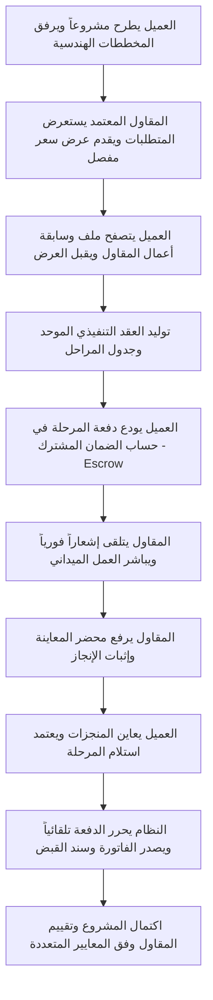

# منصة بُنيان الرقمية للمقاولات والتشطيب (Bonyan Platform)

> **المنظومة السعودية الذكية والمتكاملة لإدارة مشاريع الإنشاءات والتشطيب، التعاقد الموحد، وحساب الضمان المالي البنكي المشترك (Escrow).**

---

## 📖 نبذة عن المشروع

**منصة بُنيان** هي منصة رقمية سحابية متقدمة مبنية بأحدث تقنيات **.NET 10** وفق نمط المعمارية النظيفة (**Clean Architecture**)، ومصممة خصيصاً لتنظيم سوق المقاولات والتشطيب في المملكة العربية السعودية.

تهدف المنصة إلى القضاء على النزاعات ومشاكل التعثر والمماطلة في قطاع البناء والتشطيب عبر توفير بيئة عمل آمنة، شفافة، واحترافية تربط بين أصحاب العقارات (العملاء) ونخبة مقاولي الإنشاءات والتشطيب المعتمدين رسمياً، مع حماية كاملة لأموال العميل ومستحقات المقاول من خلال **نظام الضمان المالي المشترك (Escrow)** والرقابة على مراحل الإنجاز الميداني.

---

## 🌟 أبرز مميزات وخدمات المنصة

### 1. 🛡️ نظام الضمان المالي البنكي المشترك (Escrow Guarantee System)
* **حماية بنكية للأموال:** لا يتم تحويل قيمة المشروع مقدماً إلى المقاول ولا تظل بحوزة العميل دون ضمان، بل تُودع الدفعات وتُجمد في حساب بنكي وسيط مشفر (حساب الضمان).
* **إطلاق مشروط بالمطابقة:** لا يتم تحرير الدفعة وصرفها إلى حساب المقاول إلا بعد إنجاز المرحلة الميدانية ورفع إثباتات المعاينة وموافقة العميل الرسمية.
* **محاكاة بوابات الدفع الوطنية والدولية:** دعم وسائل السداد المعتمدة في المملكة (مدى Mada، فيزا Visa، ماستركارد Mastercard، أبل باي Apple Pay، ونظام سداد Sadad).
* **التحقق البنكي الآمن (3D Secure OTP):** محاكاة رمز التحقق الثنائي لضمان أمان العمليات البنكية.

### 2. 📜 وثيقة العقد التنفيذي الموحد والطباعة الرسمية (Unified Saudi Construction Agreement)
* **صياغة قانونية متوافقة مع كود البناء السعودي (SBC):** صياغة محكمة ومستندة للأنظمة التنفيذية لوزارة الشؤون البلدية والقروية والإسكان.
* **بيانات رسمية موثقة:** توثيق بيانات الطرف الأول (صاحب العمل ورقم الهوية)، والطرف الثاني (المقاول ورقم السجل التجاري والتصنيف والرقم الضريبي).
* **جدول الدفعات والمراحل التنفيذية:** توثيق تفصيلي لكل مرحلة، نسبة الإنجاز، المبلغ المستحق، وحالة التأمين بالضمان.
* **أختام وتواقيع إلكترونية معتمدة:** رمز أمان وتوثيق مشفر فريد لكل عقد (`SEC-VERIFY-BYN-XXXX`) ومرجع ضمان بنكي.
* **جاهزية الطباعة والحفظ كملف PDF:** تصميم احترافي متطابق مع مقاس A4 عبر خيارات الطباعة المباشرة (`@media print`).

### 3. 🧾 الفواتير وسندات القبض الإلكترونية المعتمدة (E-Invoicing & Receipts)
* **سندات قبض رقمية:** إصدار سند قبض إلكتروني فوري لكل عملية إيداع بالضمان مع رقم مرجعي بنكي فريد.
* **فاتورة ضريبية نظامية:** حساب ضريبة القيمة المضافة (15% VAT) وعمولات المنصة بدقة.
* **رمز استجابة سريعة (QR Code):** رمز QR مشفر لكل فاتورة للتحقق الفوري من سلامة وصحة السند.

### 4. 🏢 الملف التعريفي وسابقة الأعمال الموثقة (Verified Contractor Profiles & Portfolio)
* **ملف عام معتمد:** صفحة عامة لكل منشأة تعرض شارات التوثيق (سجل تجاري موثق، مقاول معتمد).
* **سابقة أعمال موثقة فعلياً:** معرض المشاريع المنفذة يضم حصراً المشاريع التي اكتملت واستُلمت عبر المنصة لمنع تزييف سابقة الأعمال.
* **مؤشرات قياس الرضا متعددة الأبعاد:** تقييمات تراكمية تقيس (جودة التنفيذ والتشطيب، الالتزام بالمواعيد، الاحترافية والتجاوب، والتقييم العام).
* **دليل تصفح المقاولين العام:** دليل تفاعلي للبحث والتصفية حسب المدينة (الرياض، جدة، الدمام، مكة، المدينة...) والتخصص المهني.

### 5. 📐 إدارة المخططات الهندسية والمرفقات الفنية
* **دعم ملفات الكاد والهندسة:** رفع واستعراض مخططات الأوتوكاد (`.dwg`) والملفات التنفيذية (`.pdf`) والصور الإنشائية عالية الدقة.
* **محاضر المعاينة والاستلام الميداني:** تمكين المقاول من إرفاق صور وتقارير إنجاز المراحل، وإتاحة تحميلها للمالك لمعاينتها قبل الاعتماد المالي.

### 6. 💬 المحادثات الميدانية الفورية والإشعارات الحية (SignalR Real-time Hubs)
* **محادثات فورية مشفرة:** تواصل لحظي بين المالك والمقاول داخل صفحة كل عقد لمتابعة التعديلات الميدانية بدقة وتوثيق الاتفاقات.
* **مركز إشعارات حي في شريط التنقل:** عداد فوري للإشعارات غير المقروءة، وقائمة منسدلة بالتحديثات الأخيرة، وتنبيهات Toast فورية تظهر على الشاشة عند إيداع دفعة أو اعتماد مرحلة أو إرسال تقييم.

### 7. 👑 لوحة القيادة والرقابة المركزية للمدير (Admin Oversight Dashboard)
* **لوحة الرقابة المالية وإدارة الضمان (`/Admin/Finances`):** متابعة لحظية لتدفقات الأموال المحجوزة بالضمان، المبالغ المصروفة للمقاولين، وأرباح المنصة من العمولات (5%).
* **سجل العمليات البنكية (Audit Trail):** تدقيق شامل لكافة العمليات المالية مع أرقام المراجع البنكية وحالات المعاملات وروابط الفواتير.
* **فحص وتوثيق المنشآت:** مراجعة السجلات التجارية للمقاولين، وتدقيق المستندات، واعتماد أو رفض الحسابات.
* **مراقبة المشاريع:** استعراض وتحليل حركة كافة المشاريع والعروض المطروحة في المملكة.

---

## 🏗️ المعمارية التقنية (Clean Architecture)

تم بناء المنصة وفق مبادئ هندسة البرمجيات الحديثة وفصل الاهتمامات عبر 4 طبقات مستقلة:

```
ContractingPlatform/
│
├── src/Core/
│   ├── ContractingPlatform.Domain/          # الكيانات، التعدادات، القواعد الأساسية، والكيان الأساسي BaseEntity
│   └── ContractingPlatform.Application/     # واجهات الخدمات (Interfaces)، DTOs، والمنطق الوظيفي المجرد
│
├── src/Infrastructure/
│   └── ContractingPlatform.Infrastructure/  # EF Core، الاتصال بـ SQL Server، الخدمات، SignalR، وبوابة الدفع
│
└── src/Presentation/
    └── ContractingPlatform.Web/             # وحدات التحكم (Controllers)، الواجهات (Razor Views)، Hubs، والملفات الثابتة
```

### التقنيات المستخدمة (Tech Stack)
* **إطار العمل الأساسي:** .NET 10 / C# 13 (ASP.NET Core MVC & RESTful Services)
* **قاعدة البيانات:** Microsoft SQL Server 2022 عبر Entity Framework Core 10
* **التواصل اللحظي:** ASP.NET Core SignalR
* **نظام المصادقة والصلاحيات:** ASP.NET Core Identity مع التشفير وكلمات المرور المعقدة وحماية RBAC
* **الواجهات والتصميم:** HTML5, CSS3, JavaScript (ES6+), Bootstrap 5 RTL, Bootstrap Icons
* **التصميم والسمة:** هوية معمارية مخصصة (Midnight Navy, Escrow Emerald, Safety Amber, Architectural Slate)

---

## 🔒 معايير الأمان وحماية البيانات (Security & Hardening)

تطبق المنصة أعلى معايير الحماية السيبرانية المتوافقة مع تصنيفات **OWASP Top 10**:
* **الحماية من هجمات BOLA / IDOR:** فحص صارم للصلاحيات في كافة الخدمات للتأكد من أن العميل أو المقاول لا يستطيع الوصول إلا لعقوده ومشاريع فريقه فقط.
* **مكافحة تزييف الطلبات (CSRF):** تطبيق وسوم التحقق `[ValidateAntiForgeryToken]` على جميع نماذج الإرسال.
* **حماية ترويسات الأمان (Security Headers):** حقن الترويسات `X-Content-Type-Options: nosniff`، `X-Frame-Options: SAMEORIGIN`، `X-XSS-Protection`، و `Referrer-Policy`.
* **الحماية من هجمات حقن الأوامر و XSS:** تعقيم المدخلات، استخدام الاستعلامات المجهزة في EF Core، وتشفير المخرجات.
* **سجل التدقيق الأمني (Security Audit Logs):** تسجيل وتوثيق كافة العمليات الحساسة ومحاولات الدخول المشبوهة في جدول `SecurityLogs`.

---

## 🚀 دليل التثبيت والتشغيل المحلي

### المتطلبات الأساسية
1. تثبيت **[.NET 10 SDK](https://dotnet.microsoft.com/download)**.
2. توفر خادم **Microsoft SQL Server** (أو SQL Server Express / LocalDB).

### خطوات الإعداد والتشغيل

1. **استنساخ المستودع:**
   ```bash
   git clone <repository-url>
   cd "منصه مقاولات"
   ```

2. **ضبط الاتصال بقاعدة البيانات:**
   عدّل مسار الاتصال في `src/Presentation/ContractingPlatform.Web/appsettings.json`:
   ```json
   "ConnectionStrings": {
     "DefaultConnection": "Data Source=IBRAHIM;Initial Catalog=ContractingPlatformDb;Integrated Security=True;Encrypt=True;TrustServerCertificate=True;"
   }
   ```

3. **تطبيق الترحيلات وبناء قاعدة البيانات:**
   ```bash
   dotnet ef database update --project src/Infrastructure/ContractingPlatform.Infrastructure --startup-project src/Presentation/ContractingPlatform.Web
   ```

4. **بناء وتشغيل المشروع:**
   ```bash
   dotnet run --project src/Presentation/ContractingPlatform.Web/ContractingPlatform.Web.csproj --launch-profile http
   ```
   *ستعمل المنصة على الرابط:* `http://localhost:5055`

---

## 🔑 الحسابات الافتراضية الجاهزة للاختبار (Seed Data)

تم إعداد بيانات تجريبية واقعية جاهزة فور التشغيل لاختبار كافة السيناريوهات:

| الدور | البريد الإلكتروني | كلمة المرور | الصلاحيات والوظائف |
| :--- | :--- | :--- | :--- |
| **المشرف العام (Admin)** | `admin@contracting.com` | `Admin@123456` | الرقابة المالية للضمان، فحص واعتماد المقاولين، مراقبة المشاريع |
| **المقاول المعتمد (Contractor)** | `contractor@builder.com` | `Contractor@123456` | تقديم العروض، رفع إثباتات الإنجاز، واستقبال الدفعات المحررة |
| **صاحب العمل (Client)** | `client@home.com` | `Client@123456` | طرح المشاريع، إيداع دفعات الضمان، واعتماد المراحل، وتقييم المقاول |

---

## 🗺️ خارطة رحلة المستخدم في المنصة (End-to-End User Flow)



---

## 📄 التراخيص والحقوق
جميع الحقوق محفوظة © 2026 - **منصة بُنيان لتقنية المقاولات والتشطيب بالمملكة العربية السعودية**.
